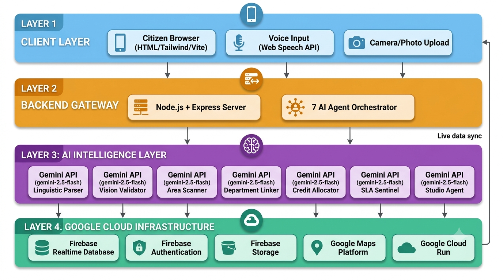

# 📢 StreetVoice -  Hyperlocal Problem Solver


<p align="center">


</p>

<p align="center">
  
</p>

---

## 🚶 A Citizen's Morning

A resident walks past the same broken streetlight every day on her way to the market. She's complained before — a phone call to a helpline that went nowhere, a paper form she never heard back about. So she stopped complaining. Most people do, eventually. That silence isn't apathy — it's what happens when reporting a problem feels like shouting into a void.

**StreetVoice exists to break that silence.**

She opens the app, taps the mic, and says it the way she'd say it to a neighbor: *"Bandar Road pe bahut bada pothole hai, gaadiyan phas rahi hain."* Within seconds, an AI agent has cleaned that up into a structured civic report — category, location, urgency — without forcing her to fill out a form in a language or format that isn't hers. A second agent checks if anyone nearby reported the same thing. A third figures out which municipal department should actually own this. The report lands on a public map, color-coded by severity, visible to her whole neighborhood — not buried in a ticketing system only one office can see.

If she wants to push harder, she generates an awareness poster in two clicks and shares it. Other citizens nearby can verify her report, confirm it's still happening, or mark it resolved once it's fixed — and the system remembers and rewards that participation, instead of just thanking her and moving on.

That's the loop StreetVoice was built to close: **report → understand → route → make visible → verify → resolve** — with AI doing real reasoning at almost every step, not just decorating a form.

Built for **Vibe2Ship Hackathon 2026**, against an assigned civic-issue-reporting problem statement — by a hackathon builder who wanted to ship something that could plausibly survive contact with real use, not just a demo click-through.

---

## 🎬 Demo Media

> 📹 Demo video — *add your link here before submission*
>
> 🌐 Live deployment — [*Launch the production web app*](https://streetvoice-116985470713.asia-south1.run.app)

---

## 🤖 Why This Isn't "A Chatbot That Reports Potholes"

The easy version of this idea is a single prompt: *"User describes a problem, AI replies with sympathy and a category."* That's not what's running here. StreetVoice's intelligence is **agentic, not conversational** — seven separate, narrowly-scoped agents, each with one job, each called deliberately from a specific point in the product, each doing something a single generic prompt would do badly:

| Agent Identity | Persona & Role | Operational Vector |
|---|---|---|
| 🗣️ **Linguistic Parser** | Multilingual Triage Officer | Cleans mixed Hindi/English/Hinglish complaints (typed or voice-transcribed) into structured civic-English, classifies category and urgency |
| 👁️ **Vision Validator** | Photo Triage Agent | Analyzes an uploaded evidence photo directly — returns category, severity score, and suggested department as structured JSON, no human pre-labeling |
| 📍 **Area Scanner** | Hotspot Detector | Cross-references existing reports to surface nearby duplicates and emerging hotspots before a new ticket is even filed |
| 🏛️ **Department Linker** | Routing Officer | Identifies which municipal department is actually responsible, and explains its routing decision rather than just outputting a label |
| 🪙 **Credit Allocator** | Engagement Economist | Calculates a context-aware StreetCredit reward (a detailed report with photo evidence is worth more than a one-line text) instead of a flat number |
| ⏱️ **SLA Sentinel** | Accountability Tracker | Estimates a realistic resolution timeline and escalation threshold for the specific issue reported |
| 🎨 **Studio Agent** | Civic Designer | Writes the headline, picks a severity-driven color palette, and generates a campaign hashtag for a real, shareable awareness poster |

Each agent has its own prompt, its own job, and its own real Gemini API call behind it. None of this is templated copy with variables swapped in — every output above is genuinely generated per-request based on the actual text or image the citizen submitted.

---

## ✨ The Full Feature Set

### 🎙️ Multilingual Voice & Text Reporting
English or Hindi, picked via a toggle (the underlying Web Speech API can't truly auto-detect spoken language, so we're upfront about that rather than overpromising). The Linguistic Parser extracts a clean title, category, location, and description from whatever the citizen actually said.

### 🗺️ Live, Color-Coded Risk Map
Every report appears on a real Google Map within seconds via a live Firebase listener — color-coded blue/yellow/red by severity, with uploaded evidence photos visible directly in the click-through info window.

### 📊 Impact Dashboard & Predictive Insights
Beyond just listing reports, the map view surfaces the top reported category and hotspot location instantly, and — on a real Gemini call, not a canned response — analyzes the actual live report data to identify a trend direction (rising/stable/falling) and one specific, actionable prediction. If there isn't enough data yet, it says so honestly instead of inventing a pattern.

### ✅ Community-Driven Status Tracking
Reports carry a real status (Open → In Progress → Resolved), and **any signed-in citizen** — not just the original reporter — can advance that status, mirroring how community accountability actually works: the person who notices a pothole got fixed is often not the person who originally reported it.

### 🏆 StreetCredits — Real Gamification, Honestly Framed
A genuinely working points and leaderboard system, with AI-calculated reward values (via the Credit Allocator agent) and duplicate-action protection so no one can farm credits by spamming the same action. It carries no monetary or government-redeemable value — and the app states that directly, rather than overstating it.

### 🎨 AI Poster Studio
Generates a civic awareness notice — headline, severity-driven color psychology, hashtag — from a real Gemini call, rendered into a downloadable, shareable PNG with a location-pointer callout design, plus native share-sheet support for actually spreading it.

### 🔐 Secure-by-Default, Friction-Free Identity
Every visitor gets a real Firebase Anonymous Auth identity with zero login screens, while Realtime Database rules enforce `auth != null` on every read and uid-ownership checks on every write — not left in default open/test mode. Status updates get a deliberately narrower rule, since community-driven resolution-marking is intentionally open to any verified citizen, not just the original reporter.

### 📷 Real Evidence Storage
Photos and videos attached to reports upload to Firebase Storage in the background — the report itself submits and the AI pipeline runs immediately, without making the citizen sit and wait through a slow mobile upload before anything happens.

---

# 🏗️ System Architecture

StreetVoice follows a modular, cloud-native architecture that combines multimodal user input, a specialized multi-agent AI pipeline, Google Cloud services, and real-time community collaboration into a single civic reporting workflow.

<p align="center">
  
</p>

---

## 🏗️ Technology Stack Matrix

| Layer | Technology | Function |
|---|---|---|
| **Frontend UI** | HTML5, Tailwind CSS, Vanilla JS, Vite | Multi-theme (90s / Y2K / Modern) presentation layer |
| **Typography** | Google Fonts (Space Grotesk, Syne) | Brand typography across leaderboard and profile views |
| **Backend Gateway** | Node.js, Express | Agent orchestration, request routing, payload serialization |
| **AI Intelligence** | Gemini API (`gemini-2.5-flash`) | Multi-agent text reasoning, vision triage, structured JSON extraction, predictive analysis |
| **Asset Generation** | Gemini ("Nano Banana") image generation, Adobe Firefly | Citizen avatar artwork,Background Video |
| **Prompt Design** | Google AI Studio | Every agent prompt was tested and refined in AI Studio's playground before being wired into the backend — not written blind |
| **Frontend Exploration** | Google Stitch | Early UI/design direction exploration |
| **Database** | Firebase Realtime Database | Live report + user data store |
| **Auth** | Firebase Authentication (Anonymous) | Secure, login-free citizen identity |
| **Storage** | Firebase Storage | Evidence photo/video uploads |
| **Maps** | Google Maps Platform | Live geospatial report visualization |
| **Deployment** | Google Cloud Run | Production hosting |

---

## 🧭 The Complete User Journey

This is the actual end-to-end path a single report takes through the system — the story above, mapped to real code:

1. Citizen opens the app → gets a real anonymous Firebase identity instantly, no signup
2. Reports an issue by **voice** (EN/HI toggle) or **text**, optionally attaching a photo
3. **Linguistic Parser** (voice/text) or **Vision Validator** (photo) extracts structured fields
4. **Area Scanner** checks for existing nearby duplicates; **Department Linker** identifies the responsible authority
5. Report writes to Firebase instantly — evidence photo uploads in the background without blocking anything
6. **Credit Allocator** awards a context-aware StreetCredit amount; a toast confirms it
7. Report appears live on the map, color-coded by severity, with a default **Open** status
8. Other citizens browse the public feed/map, **verify** the report, or eventually mark it **In Progress** / **Resolved** — earning their own credits for doing so
9. The map's **Impact Dashboard** continuously re-analyzes all live reports for real trend patterns
10. Optionally, the original citizen generates an **AI Poster** and shares it externally to build public pressure

---

## 🚀 Running it Locally

```bash
# Clone the repository
git clone https://github.com/your-username/streetvoice.git
cd streetvoice

# Install dependencies
npm install

# Configure environment variables
# Copy .envEXAMPLE to .env and add your real key:
# GEMINI_API_KEY=your-gemini-api-key

# Fill in your Firebase project config in firebase-config.js
# (Project Settings → General → Your apps, in the Firebase Console)

# Run frontend + backend together
npm run dev:all
```

Open the URL Vite prints (typically `http://localhost:5173`). **Do not** open the HTML files directly via `file://` — Google Maps and several Firebase features require a real server context to work.

### `POST /api/run-agent`

Runs a single named agent against provided input text.

```json
{
  "agentId": "1",
  "inputText": "Bada gaddha hai school ke saamne",
  "extraContext": "Action type: civic complaint triage."
}
```

Additional dedicated endpoints handle image-based triage (`/api/analyze-image`), poster generation (`/api/generate-poster`), email drafting (`/api/draft-email`), voice complaint parsing (`/api/parse-voice-complaint`), and predictive analysis (`/api/predictive-insights`).

---

## 🏆 Hackathon Evaluation Matrix Alignment

| Evaluation Category | Weight | Practical Execution in StreetVoice |
|---|---|---|
| **Problem Solving & Impact** | 20% | Targets a real, common civic friction point — slow, opaque infrastructure complaint systems — with a working report-to-routing-to-public-resolution pipeline, including community-driven status tracking, not just a report-and-forget concept |
| **Agentic Depth** | 20% | Seven distinct Gemini agents, each with a focused prompt, a defined responsibility, and a real API call — linguistic parsing, vision triage, hotspot detection, department routing, credit allocation, SLA estimation, and poster generation |
| **Innovation & Creativity** | 20% | Voice-first multilingual reporting, AI-calculated gamification, real predictive trend analysis on live data, and AI-assisted civic awareness poster generation — combined, not single-feature |
| **Usage of Google Technologies** | 15% | Gemini API, Google AI Studio, Google Maps Platform, Firebase (Realtime Database, Authentication, Storage), Google Fonts, Google Cloud Run, Google Stitch |
| **Product Experience & Design** | 10% | Three switchable design generations (90s / Y2K / Modern), toast notifications, bilingual UI, non-blocking background uploads, an accessible FAQ addressing real points of user confusion |
| **Technical Implementation** | 10% | Real Firebase Auth + locked, ownership-checked database rules with a deliberate community-write exception for status updates; graceful degradation on every external dependency (voice, Storage, network failures) |
| **Completeness & Usability** | 5% | A genuinely closed loop: report → AI triage → routing → public map → community verification → resolution — tested end to end, not just individual pages in isolation |

---

## 🔒 Security Notes

* **✅ No secrets in source control:** The real `GEMINI_API_KEY` lives only in a gitignored `.env` file — never committed.
* **✅ Firebase config is intentionally public:** `firebase-config.js` contains a public-facing web app key by Firebase's own design; the actual security boundary is the Realtime Database Rules, which require authentication and per-user write ownership — with one deliberate exception (status updates) explained above.
* **✅ Anonymous-but-accountable identity:** Every citizen gets a real `auth.uid`; no one can read or write another user's profile or impersonate another citizen's report.

---

## 📋 Honest Scope Notes

A few things this project intentionally does *not* claim, so there's no mismatch between this README and the actual code if anyone checks:

* StreetCredits is real and functional, but has no monetary or government-redeemable value.
* The poster's text/colors are real Gemini output; the visual layout is a styled template, not AI-generated imagery (an Imagen-based version was attempted and removed after integration issues within the build window — documented honestly rather than quietly dropped).
* Voice input requires Chrome or Edge — Firefox/Safari are unsupported by the underlying Web Speech API, and the UI states this directly rather than failing silently.
* There is no officer/department-facing dashboard yet — routing is AI-identified but not yet connected to a real municipal workflow. Community-driven status updates are the current substitute for that loop.

Full feature breakdown, roadmap, and risk notes live in [`docs/PRD.md`](./docs/PRD.md).

---

## 👩‍💻 About the Builder

I'm a 19-year-old cybersecurity and digital forensics student,. StreetVoice was built against an assigned civic-issue-reporting problem statement — not a problem I picked freely, but one I tried to take seriously rather than treat as a box to check.

My background is in security, not civic-tech or social impact work, and that shaped how I approached this: I spent real time on identity and access control (real Firebase Auth, locked database rules with deliberately scoped exceptions, not a default-open database with a public demo bolted on top) precisely because "make it secure later" is the kind of corner that's easy to cut under a deadline and expensive to fix after. A civic platform that's insecure isn't really civic infrastructure — it's a liability waiting for someone to find it.

Beyond the security lens, I wanted this to feel like a real product a citizen could actually use, not a proof-of-concept that only works in the happy path during a demo: voice input that works in the language someone actually speaks, evidence uploads that don't freeze the whole report behind a slow mobile connection, predictive insights that admit when they don't have enough data instead of confidently making things up. Most of the build time went into closing exactly those kinds of gaps — the unglamorous parts that decide whether something is a toy or a tool.

**Core areas of focus going into this:**
* 🔐 Identity, access control, and not trusting the client
* 🤖 Multi-agent orchestration — narrow, accountable AI responsibilities over one large prompt
* 🌐 Real-world failure handling — network drops, slow uploads, browsers without a feature, empty datasets
* 🏙️ Civic infrastructure as a security and trust problem, not just a UX problem

---

## 👤 Project Metadata

* **Target Event:** Vibe2Ship Hackathon 2026
* **Core Accelerators:** Gemini API, Google AI Studio, Firebase, Google Maps Platform, Google Cloud Run

*Seven agents. One civic voice. From pothole to public record, in seconds.*
